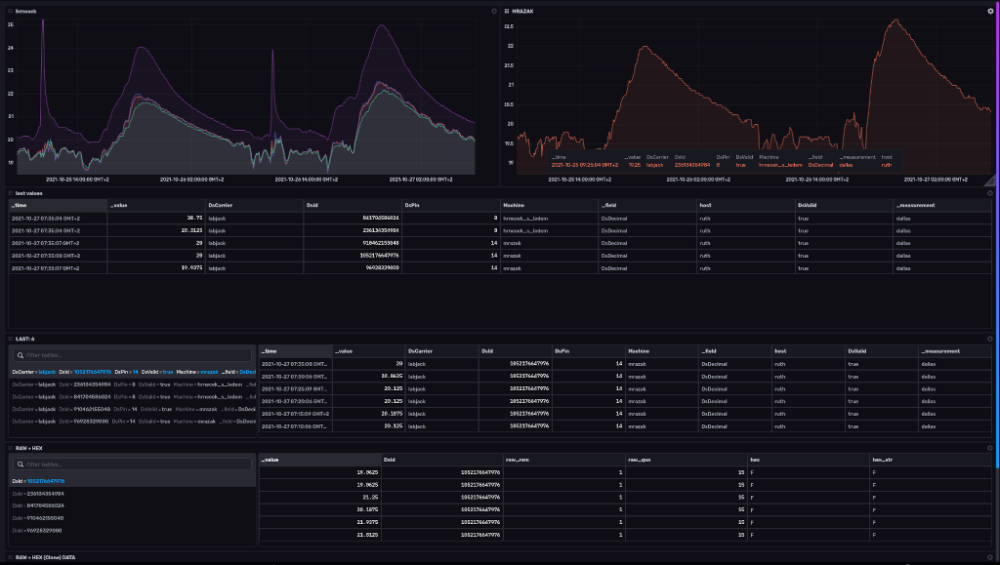
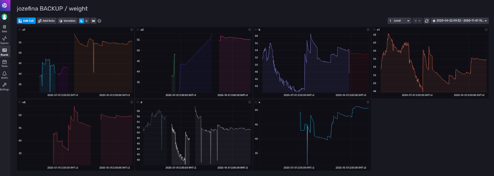
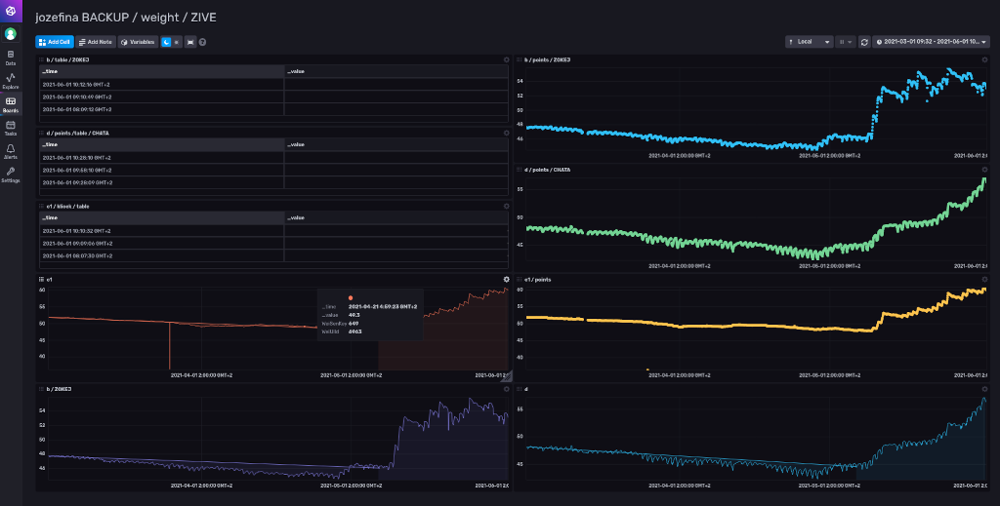
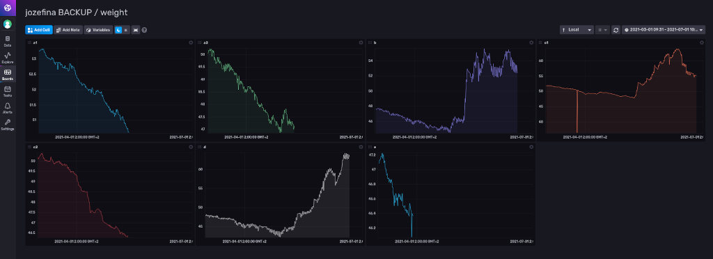
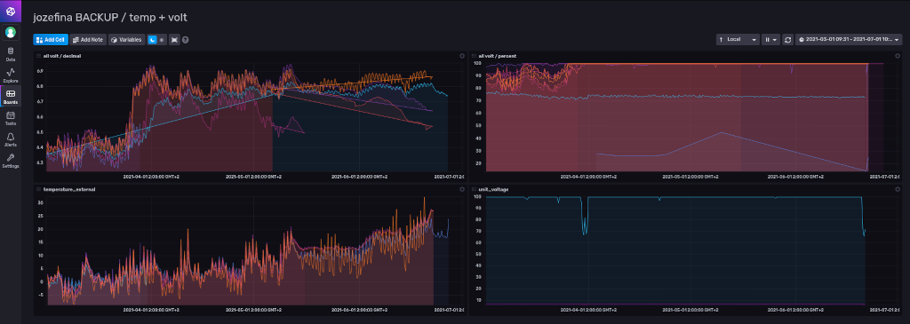

# influxdb_notes

- config https://docs.influxdata.com/influxdb/v2.0/reference/config-options/?t=TOML
- git issues UI https://github.com/influxdata/ui/issues
- forum https://community.influxdata.com/
- blog https://www.influxdata.com/blog/
- flux git https://github.com/influxdata/flux
- flux syntax https://docs.influxdata.com/flux/v0.x/get-started/syntax-basics/#examples-of-basic-syntax
- flux slide https://www.slideshare.net/influxdata/anais-dotisgeorgiou-influxdata-learn-flux-by-example-influxdays-na-2021-250534102
- stdlib all https://docs.influxdata.com/flux/v0.x/stdlib/all-functions/
- stdlib / now() https://docs.influxdata.com/flux/v0.x/stdlib/universe/now/
- functions https://docs.influxdata.com/flux/v0.x/data-types/composite/function/
- define custom func https://docs.influxdata.com/flux/v0.x/define-functions/
- if/else https://docs.influxdata.com/influxdb/cloud/query-data/flux/conditional-logic/
- git contrib hex https://github.com/influxdata/flux/tree/ba5502f37dee6119a7d3a9a70b037d152cc1e9f9/stdlib/contrib/bonitoo-io/hex
- hex.string() https://docs.influxdata.com/flux/v0.x/stdlib/contrib/bonitoo-io/hex/string/
- array https://docs.influxdata.com/flux/v0.x/data-types/composite/array/
- array.from https://docs.influxdata.com/flux/v0.x/stdlib/array/from/
- pivot https://www.influxdata.com/blog/how-to-pivot-data-flux-columnar-data/
- timestamp https://community.influxdata.com/
- assignment https://docs.influxdata.com/flux/v0.x/spec/assignment-scope/

*bees*
 

*labjack one_wire*
 

*bees_swarms_2020*
 

*bees_swarms_2021*
 

*bees_swarms_2021_pro_bee*
 

*bees_voltage_2021_pro_bee*
 

**
 

